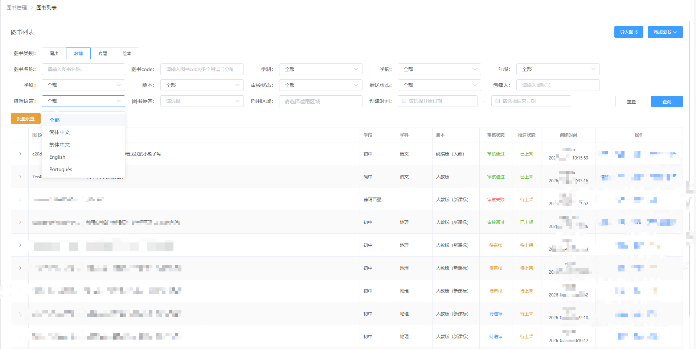
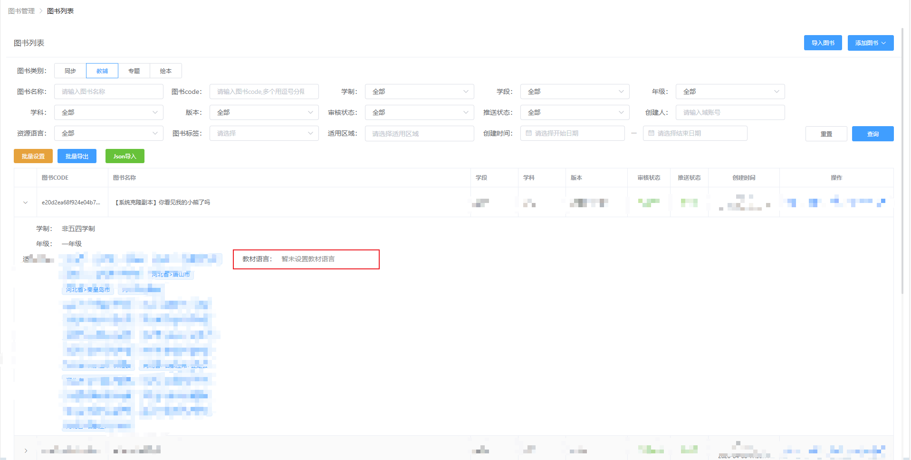
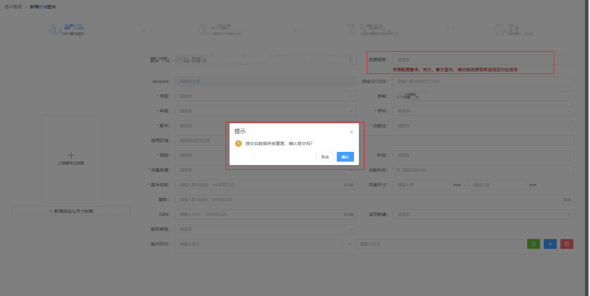
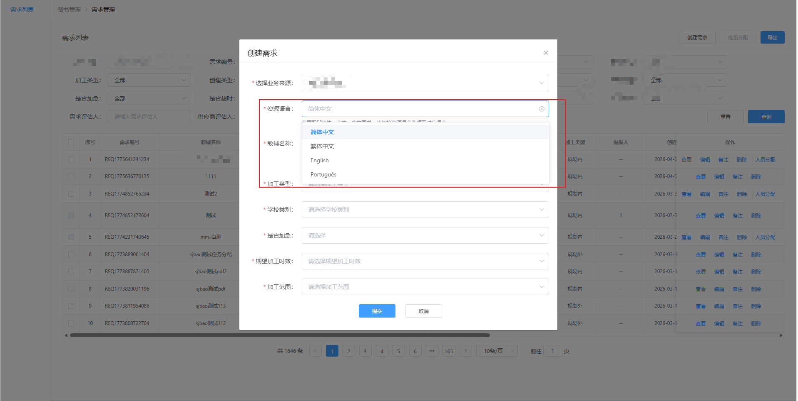
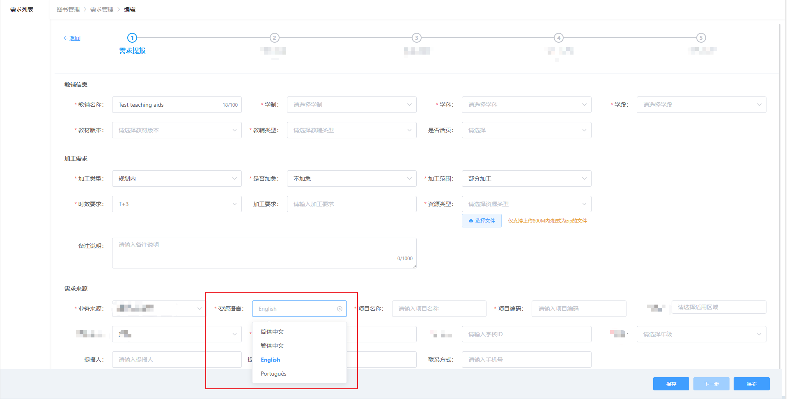
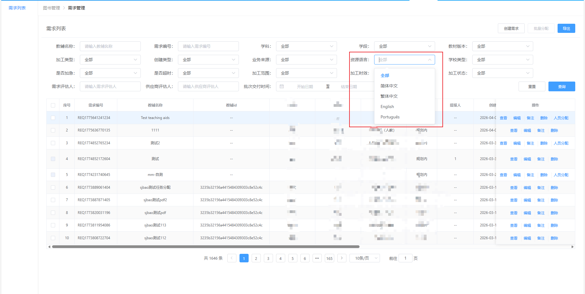

# CCode

**开源多模型 AI 编程 CLI 助手** — 支持 GLM / Claude / DeepSeek / GPT / Gemini / Ollama 及任意 OpenAI 兼容模型

> **C** = **C**odeYang（作者）· **C**hina（中国开发者出品）· **C**ode Agent

[](./LICENSE)
[](https://www.npmjs.com/package/ccode-cli)

```bash
npm install -g ccode-cli
```

## 已验证的生产力

> 不是 demo 级别的玩具，是真正在**生产环境**跑出结果的工具。

CCode 已在**多家企业**内部由一线工程师实际使用，独立完成真实业务需求开发：

| 企业 | 行业 | 验证场景 | 模型 |
|------|------|---------|------|
| **某互联网大厂** | 在线教育 / 数字出版 | 企业级后台管理系统全链路需求开发 | GLM-5 |
| **某 A 股上市公司** | 科技 | 前端 + 后端 + 复杂业务需求 | GLM-5 |
| **CCode 自身** | 开源工具 | 用 CCode 开发 CCode（自举） | GLM-5 / GLM-4.7 |

### 大厂实战案例：企业级后台系统需求交付

以下截图来自**某互联网大厂**内部后台管理系统。工程师使用 CCode + GLM-5 独立完成了一个横跨多模块的"资源语言"特性开发 — 从列表筛选、详情展示、表单新增、批量操作到需求管理全链路，**一个人 + CCode 完成了原本需要多人协作的需求**：

<table>
<tr>
<td width="50%"><br/><sub>列表页：新增资源语言筛选项 + 批量设置入口</sub></td>
<td width="50%"><br/><sub>详情展开：教材语言字段展示 + 批量导出/Json导入</sub></td>
</tr>
<tr>
<td><br/><sub>新增表单：资源语言字段联动 + 提交确认逻辑</sub></td>
<td><br/><sub>需求管理：创建需求弹窗 + 多语言选项</sub></td>
</tr>
<tr>
<td><br/><sub>多步骤流程表单：需求提报编辑 + 语言联动</sub></td>
<td><br/><sub>需求列表：1646条数据 + 语言筛选 + 分页</sub></td>
</tr>
</table>

### 自举案例：用 CCode 开发 CCode

CCode 的 SubAgent 子 Agent 系统、Web Dashboard、记忆系统等核心模块，均由 CCode 自身驱动开发完成。以下是通过 Web Dashboard 会话回放功能录制的真实开发过程：


<sub>CCode 在 Web Dashboard 中回放自举开发 SubAgent 的完整会话过程 — 从分析需求、阅读代码、到实现功能全部由 Agent 自主完成</sub>

**覆盖能力**：

- **前端** — React / Vue 组件开发、复杂表单联动、列表筛选、弹窗交互、多步骤流程
- **后端** — Java Spring Boot 服务、API 接口设计、数据库字段变更与迁移
- **全链路** — 从数据库 → API → 前端页面的完整功能闭环，跨模块一致性保障

> 完整案例见 [cases/](./cases/) 目录

---

## 安装与使用

### npm 安装（推荐）

```bash
npm install -g ccode-cli
ccode
```

### npx 临时运行

```bash
npx ccode-cli
```

### 从源码运行

```bash
cd cCli
pnpm install
pnpm dev
```

---

## 快速配置

首次启动自动创建 `~/.ccode/config.json`。本项目全程在 **智谱 GLM** 下开发测试，最小配置：

```jsonc
{
  "defaultProvider": "glm",
  "defaultModel": "glm-5",
  "subAgentModel": "glm-4.7",          // [可选] 子 Agent 使用的模型，不配则继承主 Agent
  "providers": {
    "glm": {
      "apiKey": "your-zhipu-api-key",
      "baseURL": "https://open.bigmodel.cn/api/coding/paas/v4",
      "models": ["glm-5", "glm-4.7"]
    }
  }
}
```

1. 前往 [智谱开放平台](https://open.bigmodel.cn/) 注册并获取 API Key
2. 将上述配置写入 `~/.ccode/config.json`，替换 `your-zhipu-api-key`
3. 启动 `ccode`，即可使用

> 只要模型服务支持 **OpenAI Chat Completion** 或 **Anthropic Messages** 协议，配置 `baseURL` + `apiKey` 即可接入，无需任何代码改动。

### config.json 完整字段说明

```jsonc
{
  // ────── 全局设置 ──────
  "defaultProvider": "glm",          // 默认使用的 Provider 名称
  "defaultModel": "glm-5",           // 默认模型（必须在对应 provider.models 列表中）
  "subAgentModel": "glm-4.7",       // [可选] 子 Agent 独立模型，不配则继承主 Agent 当前模型
  "statusBar": true,                 // 是否显示底部状态栏（token 消耗、模型名等）

  // ────── Provider 配置 ──────
  "providers": {
    "<provider-name>": {             // 自定义名称，如 "glm"、"anthropic"、"my-proxy"
      "apiKey": "sk-xxx",            // [必填] API 密钥
      "baseURL": "https://...",      // [可选] 自定义 API 端点（OpenAI 兼容协议必填）
      "protocol": "openai",          // [可选] 协议类型："openai"(默认) | "anthropic"
      "models": ["model-a", "model-b"],  // [必填] 该 provider 可用的模型列表
      "visionModels": ["model-a"]    // [可选] 支持图片理解的模型子集（默认空 = 全不支持）
    }
  }
}
```

| 字段 | 类型 | 必填 | 说明 |
|------|------|------|------|
| `defaultProvider` | string | 是 | 启动时默认使用的 Provider |
| `defaultModel` | string | 是 | 启动时默认使用的模型 |
| `subAgentModel` | string | 否 | 子 Agent 独立模型，不配则继承主 Agent 当前模型。模型优先级：LLM 显式指定 > `subAgentModel` > 继承父 Agent。必须在同 Provider 的 `models` 列表中 |
| `statusBar` | boolean | 否 | 底部状态栏开关，默认 `true` |
| `providers.<name>.apiKey` | string | 是 | API 密钥 |
| `providers.<name>.baseURL` | string | 否 | 自定义端点。Anthropic 可省略，OpenAI 兼容协议必填 |
| `providers.<name>.protocol` | string | 否 | `"openai"`（默认）或 `"anthropic"`。仅 Anthropic 官方需设为 `"anthropic"` |
| `providers.<name>.models` | string[] | 是 | 可用模型列表，`/model` 切换时从此列表选择 |
| `providers.<name>.visionModels` | string[] | 否 | 支持多模态图片理解的模型子集（必须是 `models` 的子集），默认空数组 |

<details>
<summary>多 Provider 配置示例</summary>

```jsonc
{
  "defaultProvider": "glm",
  "defaultModel": "glm-5",
  "subAgentModel": "glm-4.7",        // 子 Agent 用轻量模型，降低成本
  "providers": {
    "glm": {
      "apiKey": "your-zhipu-api-key",
      "baseURL": "https://open.bigmodel.cn/api/coding/paas/v4",
      "models": ["glm-5", "glm-4.7"]
    },
    "anthropic": {
      "apiKey": "sk-ant-xxx",
      "protocol": "anthropic",
      "models": ["claude-sonnet-4-20250514"],
      "visionModels": ["claude-sonnet-4-20250514"]
    },
    "deepseek": {
      "apiKey": "sk-xxx",
      "baseURL": "https://api.deepseek.com/v1",
      "models": ["deepseek-chat", "deepseek-reasoner"]
    },
    "openai": {
      "apiKey": "sk-xxx",
      "models": ["gpt-4o", "gpt-4o-mini"],
      "visionModels": ["gpt-4o"]
    },
    "ollama": {
      "apiKey": "ollama",
      "baseURL": "http://localhost:11434/v1",
      "models": ["qwen2.5:7b", "deepseek-r1:14b"]
    }
  }
}
```

</details>

---

## 三种运行模式

### 交互模式（默认）

```bash
ccode                # 进入交互式终端对话
ccode --web          # 交互模式 + Web Dashboard
ccode --resume       # 恢复上一次会话
```

### 管道模式（非交互，适用于脚本 / CI）

```bash
ccode "这段代码有什么问题"                     # 单次问答
cat error.log | ccode "分析这个错误日志"        # stdin 管道输入
ccode -p "生成 API 文档" --json                # JSON 结构化输出
ccode "跑测试并修复" --yes                     # 自动批准工具（CI 场景）
ccode "解释这个函数" --no-tools                # 纯对话，不调用工具
```

| 参数 | 说明 |
|------|------|
| `-p / --prompt` | 指定问题 |
| `-m / --model` | 指定模型 |
| `--provider` | 指定供应商 |
| `--yes / -y` | 自动批准所有工具调用 |
| `--no-tools` | 禁用工具，纯对话 |
| `--json` | 结构化输出（response + usage + cost） |
| `--verbose / -v` | stderr 输出工具执行进度 |

### Web Dashboard 模式（Claude Code 没有的能力）

> 这是 CCode 与 Claude Code CLI 拉开差距的核心能力。Claude Code 是纯终端工具，没有可视化管理界面；CCode 自带完整的 Web Dashboard，让 AI Agent 的工作过程可观测、可管理、可协作。

```bash
ccode --web          # 启动 CLI + Bridge Server + Web Dashboard
```

浏览器打开 `http://localhost:9800`，获得 5 大管理页面：

<!-- 截图占位：你可以在 docs/res/ 下放截图，用  引用 -->

#### 1. 总览大盘（Overview）

- **6 大核心指标卡片**：调用次数、输入/输出/缓存 Token、总费用
- **趋势图表**：Token 消耗曲线 + 费用曲线，时间粒度自适应（当日按小时，周/月按天）
- **分布分析**：Provider 分布饼图 + 模型分布饼图
- **时间范围**：当日 / 本周 / 本月 / 自定义日期区间
- **最近会话列表**：快速跳转到对话详情

#### 2. 实时对话（Chat）

- **Web 端直接聊天**：与 CLI 终端体验一致，支持 Markdown 渲染 + 代码高亮
- **双向实时同步**：CLI 端输入 → Web 实时看到，Web 端输入 → CLI 实时响应
- **工具执行可视化**：工具调用名称、参数、执行结果、耗时全部可视化展示
- **权限确认弹窗**：危险工具（写文件、执行命令）在 Web 端弹窗确认，不用切回终端
- **用户问卷表单**：Agent 发起的 ask_user_question 在 Web 端渲染为原生表单（单选/多选/文本）
- **流式输出**：思考中状态提示 + 逐字流式渲染

#### 3. 对话历史（Conversations）

- **全量会话列表**：按时间倒序，展示 Provider、模型、Token 消耗、时长
- **消息回放**：完整还原每轮对话，包括用户输入、助手回复、工具调用链
- **子 Agent 快照**：展开查看子 Agent 的独立执行日志
- **一键恢复对话**：点击 [恢复] 按钮，在当前 CLI 实例上继续历史会话
- **搜索过滤**：按关键词搜索历史会话

#### 4. 设置管理（Settings）

- **Provider 配置 Tab**
  - 在线编辑 apiKey、baseURL、模型列表
  - 模型标签点击选中（指定测试模型）
  - 拖拽调整模型顺序
  - Vision 多模态标记（👁 标识支持图片理解的模型）
  - 一键连通性测试：选中模型 → 发送测试消息 → 15s 超时 → 返回成功/失败
  - **保存后实时广播**：所有连接的 CLI 实例自动热更新配置，无需重启

- **计价规则 Tab**
  - CRUD 管理：provider + model_pattern 匹配规则
  - 四维价格：input / output / cache_read / cache_write
  - 多币种：USD / CNY
  - 优先级排序：精确匹配优先于通配符

- **插件 & MCP Tab**
  - 查看已加载的 Runtime Plugin 列表、注册的工具和命令
  - MCP Server 连接状态、工具列表、错误信息

#### 5. 系统日志（Logs）

- Agent 运行诊断日志
- 系统事件追踪

#### 架构特点

```
Browser (React SPA)
  ↕ WebSocket（实时双向）
Bridge Server (port 9800) — 纯消息路由器，不持有业务状态
  ↕ WebSocket          ↕ WebSocket
CLI-1 (session-aaa)  CLI-2 (session-bbb)
```

- **多 CLI 平等连接**：多个终端实例同时连接同一个 Bridge Server
- **Session 隔离**：每个 CLI 的 sessionId 独立，Web 端按需切换查看
- **CLI 断连感知**：CLI 退出时 Web 端实时提示断开状态
- **自动端口管理**：默认 9800，冲突自动递增（9801 → 9802），最多重试 3 次
- **零配置启动**：`--web` 一个参数搞定，自动启动 HTTP Server + WebSocket + Vite HMR

---

## 核心能力

| 能力 | 说明 |
|------|------|
| **多模型运行时切换** | `/model` 一键切换，不重启、不丢上下文 |
| **17 个内置工具** | 文件读写/编辑、glob/grep 搜索、bash 执行、git 深度集成、子 Agent 派发、任务管理 |
| **子 Agent (SubAgent)** | general / explore / plan 三种类型，后台并行运行，`Ctrl+B` 实时面板，支持独立模型配置 |
| **并行工具执行** | 多个 tool_calls 自动并行，安全/危险分类策略 |
| **上下文管理** | `/compact` 三种压缩策略 + auto-compact + `/context` 查看使用率 |
| **对话持久化** | JSONL 会话 + `--resume` 恢复 + `/fork` 分支 + Web 端一键恢复 |
| **Token 计量** | 四维统计（input/output/cache_read/cache_write）+ 多币种计价 + `/usage` |

### 父子模型能力联动

子 Agent 的模型选择支持三级优先级：

1. **LLM 显式指定** — 派发时 `model` 参数指定具体模型
2. **全局配置** — `config.json` 中的 `subAgentModel` 字段
3. **继承父 Agent** — 不配置时自动使用主 Agent 当前模型

典型用法：主 Agent 用强模型（如 GLM-5）做决策和编排，子 Agent 用轻量模型（如 GLM-4.7）做搜索和文件操作，**同 Provider 内灵活切换、成本可控**。

```jsonc
{
  "defaultModel": "glm-5",        // 主 Agent：强模型，负责决策编排
  "subAgentModel": "glm-4.7"      // 子 Agent：轻量模型，负责执行任务
}
```

### Git 深度集成

- **专用 Git 工具** — 13 个子命令（status / log / diff / branch / checkout / commit / merge / rebase / cherry_pick / stash / tag / reset / show），无需通过 bash 调用 git
- **启动上下文注入** — 冷启动自动收集 Git 状态（当前分支、最近提交、工作区变更）注入 System Prompt
- **安全防护** — 敏感文件自动拦截（.env / credentials.json / .pem / .key 等）、commit 消息 shell 注入防护
- **非 Git 仓库感知** — 非 Git 目录启动时给出明确提示，而非静默忽略
- **Bash 兜底** — 超出 git 工具覆盖范围的操作（如 push、interactive rebase）仍可通过 bash 工具完成

### Memory / RAG 记忆系统

- **混合检索** — BM25 关键词 + 向量相似度，中文 jieba 分词
- **双层存储** — `~/.ccode/memory/`（全局）+ `<项目>/.ccode/memory/`（项目级）
- **LLM 工具** — `memory_write` / `memory_search` / `memory_delete`，Agent 自动读写
- **命令管理** — `/remember` 查看、搜索、删除、重建索引
- **System Prompt 注入** — 冷启动自动检索相关记忆注入上下文

---

## 支持的模型

| Provider | 协议 | 模型示例 | 备注 |
|----------|------|---------|------|
| 智谱 GLM | OpenAI 兼容 | GLM-5 / GLM-4.7 | **项目主力测试模型** |
| Anthropic | Anthropic 原生 | Claude Opus / Sonnet / Haiku 4.x | 官方 SDK 直连 |
| DeepSeek | OpenAI 兼容 | deepseek-chat / deepseek-reasoner | |
| OpenAI | OpenAI 兼容 | GPT-4o / GPT-4o-mini | |
| Google Gemini | OpenAI 兼容 | gemini-2.5-pro / gemini-2.5-flash | |
| Ollama | OpenAI 兼容 | 任意本地模型 | 本地部署 |
| **任意服务** | OpenAI 兼容 | — | 配置 `baseURL` 即可接入 |

---

## 扩展生态

### MCP 协议

动态注册外部工具，支持 4 种传输：stdio / SSE / streamable-http / http

```jsonc
// ~/.ccode/mcp.json（兼容 ~/.claude.json）
{
  "mcpServers": {
    "my-server": {
      "command": "npx",
      "args": ["-y", "my-mcp-server"],
      "transport": "stdio"
    }
  }
}
```

### Skills 系统（兼容 Claude Code Skill 生态）

- 四源发现：内置 → 插件 → 用户级(`~/.ccode/skills/`) → 项目级(`<cwd>/.ccode/skills/`)
- **SKILL.md 格式与 Claude Code 完全兼容**，社区 Skill（如 [skills.sh](https://skills.sh/) 275+ Skill）可直接使用
- LLM 自动触发或 `/skills <name>` 手动调用

> 迁移：将 Claude Code 的 `~/.claude/skills/` 复制到 `~/.ccode/skills/` 即可

### Runtime Plugin

```
~/.ccode/plugins/<name>/runtime/index.js     # 用户级
<cwd>/.ccode/plugins/<name>/runtime/index.js  # 项目级
```

扩展点：注册命令、工具、UI 按钮、状态栏、事件监听、持久化存储。

### Hooks 事件钩子

三层配置（项目 > 用户 > 插件），三类事件：

| 事件 | 时机 | 用途 |
|------|------|------|
| SessionStart | 会话启动 | 注入上下文 |
| PreToolUse | 工具调用前 | 权限控制、参数修改 |
| PostToolUse | 工具执行后 | 日志、后处理 |

---

## Claude Code 兼容性

| 特性 | CCode | Claude Code | 兼容 |
|------|-------|------------|------|
| 指令文件 | CCODE.md | CLAUDE.md | 两者均识别 |
| MCP 配置 | ~/.ccode/mcp.json | ~/.claude.json | 均可读取 |
| SKILL.md 格式 | 相同 | 相同 | 直接使用 |
| 项目设置 | .ccode/settings.local.json | .claude/settings.local.json | 格式兼容 |

---

## 全部指令

| 指令 | 别名 | 说明 |
|------|------|------|
| `/help` | — | 显示所有命令 |
| `/model` | `/m` | 切换模型 |
| `/clear` | — | 清空对话 |
| `/compact` | — | 压缩上下文 |
| `/context` | — | 上下文使用率 |
| `/resume` | — | 恢复历史会话 |
| `/fork` | — | 对话分支 |
| `/usage` | `/cost` | Token 用量统计 |
| `/gc` | `/cleanup` | 清理过期数据 |
| `/skills` | `/skill` | Skills 管理 |
| `/remember` | `/mem` | 记忆管理 |
| `/mcp` | — | MCP 状态 |
| `/bridge` | — | Bridge 管理 |
| `/plugins` | — | 插件列表 |
| `/exit` | `/quit` | 强制退出 |

## 快捷键

| 操作 | 按键 | 备用 |
|------|------|------|
| 提交输入 | Enter | — |
| 换行 | Alt+Enter | Shift+Alt+Enter |
| 光标移动 | ↑ ↓ ← → | — |
| 跳到行首/行尾 | Home / End | Ctrl+A / Ctrl+E |
| 中断流式 | Escape | Ctrl+C |
| 强制退出 | Ctrl+C × 2 | /exit |
| SubAgent 面板 | Ctrl+B | — |

---

## 配置文件一览

| 文件 | 路径 | 用途 |
|------|------|------|
| 主配置 | `~/.ccode/config.json` | Provider / Model / Shell |
| MCP | `~/.ccode/mcp.json` | MCP Server 连接 |
| 指令文件 | CCODE.md / CLAUDE.md（多层级） | System Prompt 注入 |
| 项目权限 | `<cwd>/.ccode/settings.local.json` | 工具白名单 |
| Hooks | `hooks.json`（项目/用户/插件） | 事件钩子 |
| 记忆 | `~/.ccode/memory/` + `<cwd>/.ccode/memory/` | RAG 记忆存储 |
| 调试日志 | `<cwd>/.ccode/debug.log` | Debug 日志 |

## 文档

详细架构与能力文档见 [docs/](./docs/)

## License

[BSL 1.1](./LICENSE) — 个人和非商业使用自由，商业使用需授权。

---

> 本项目原名 ZCli / ZCode，2026-03-20 更名为 CCode。历史配置文档见 [HISTORY_README.md](./HISTORY_README.md)。
